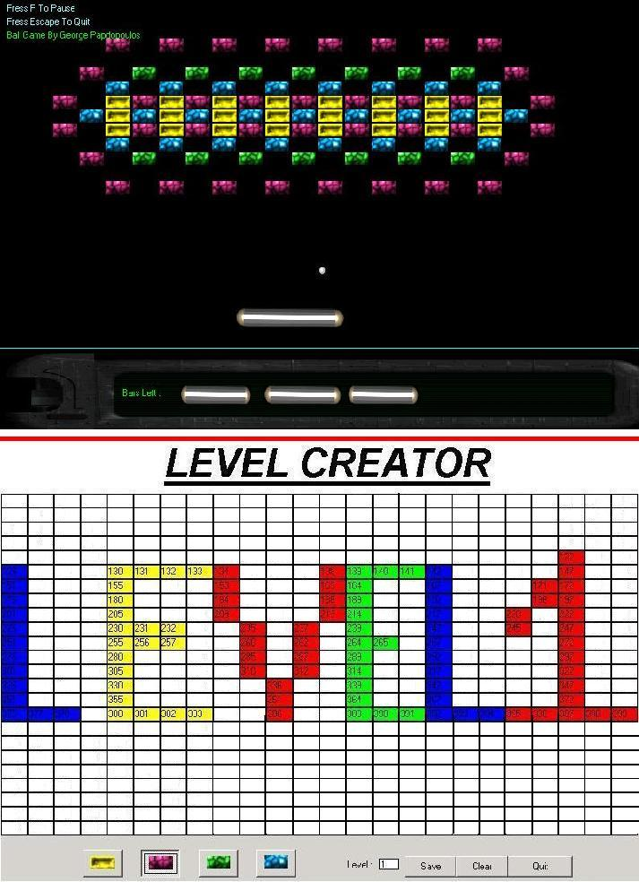



## A GREAT BALL GAME \( with level creator \)

### Description

Ball Game Is a great game . Your purpose is to destroy all the boxes by hitting them with the ball...if the ball touches the blue line you loose...the game also includes a LEVEL GREATOR...the game does not use timers so it works fine with all windows versions :)..the game shows you how to use files (to create levels),animations,sounds,object collisions and many more....Its a great game..(the game has sounds )....Have Fun..:)... comments are welcome...:)....IF YOU ARE A MEMBER PLEASE RATE MY PROJECT..thnx :)
 
### More Info
 

             |
---                |---
**Submitted On**   |2002-08-25 17:56:16
**By**             |[George Papadopoulos  \- VirusFree](https://github.com/Planet-Source-Code/PSCIndex/blob/master/ByAuthor/george-papadopoulos-virusfree.md)
**Level**          |Beginner
**User Rating**    |4.8 (53 globes from 11 users)
**Compatibility**  |VB 5\.0, VB 6\.0
**Category**       |[Games](https://github.com/Planet-Source-Code/PSCIndex/blob/master/ByCategory/games__1-38.md)
**World**          |[Visual Basic](https://github.com/Planet-Source-Code/PSCIndex/blob/master/ByWorld/visual-basic.md)
**Archive File**   |[A\_GREAT\_BA975516222002\.zip](https://github.com/Planet-Source-Code/george-papadopoulos-virusfree-a-great-ball-game-with-level-creator__1-36138/archive/master.zip)

